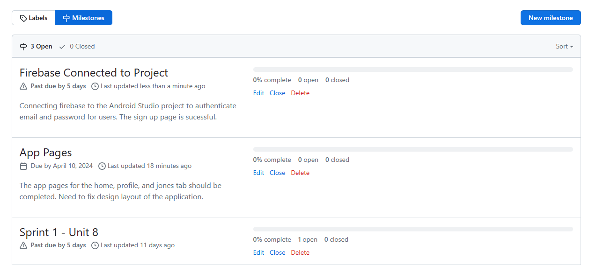
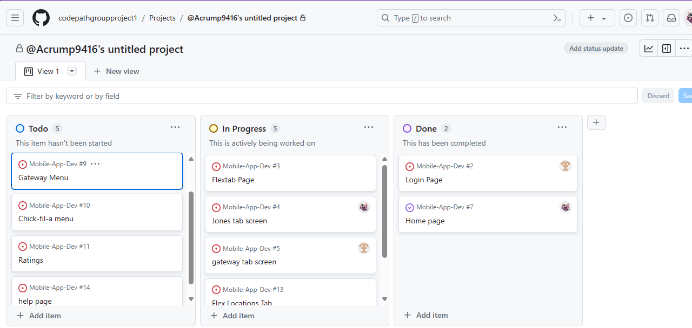
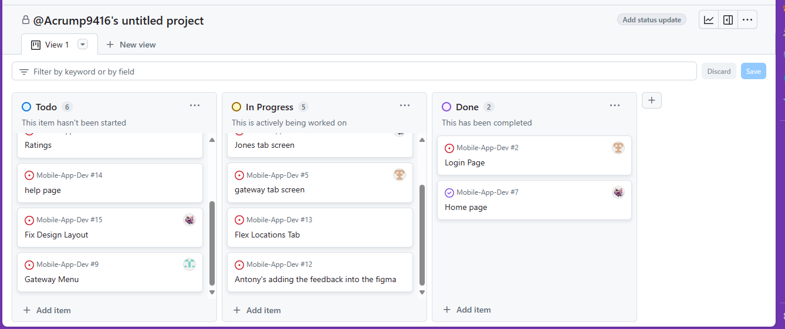

# Milestone 1 - Campus Dining (Unit 7)

## Table of Contents

1. [Overview](#Overview)
1. [Product Spec](#Product-Spec)
1. [Wireframes](#Wireframes)

## Overview

### Description

This app allows the user to see what food is at each dining hall per day. Allows users to see what food is available for the day/week at dining halls. possibly include a map for where to use flex dollars. Also, you can use your debit/credit card to pay for a meal.

### App Evaluation

[Evaluation of your app across the following attributes]
- **Category:** Food/Utility/Lifestyle
- **Mobile:** Pulls info from a website but is designed for mobile use. Utilizes maps for locating dining halls, real-time updates on food availability, possibly integrates with mobile payment options.
- **Story:** Provides convenience and time-saving for students, especially during busy periods. Clear value proposition for students looking for meal options and utilizing campus meal plans.
- **Market:** VSU campus residents. Targeted towards college students, particularly those living on campus. Potential for partnerships with universities for wider adoption.
- **Habit:** Frequency of use may vary depending on dining habits, but could become habitual during meal times or when planning meals.
- **Scope:** Initial version could focus on displaying daily/weekly menus with basic filtering options. Subsequent versions could add features like integration with campus meal plans, user reviews, and nutritional information.

## Product Spec

### 1. User Features (Required and Optional)

**Required Features**

1. Users can log in.
2. Users can check the menu from the dining halls. 
3. Users can create a new account. 

**Optional Features**

1. Users can view their Flex Dollars balance
2. Users can leave reviews for the dining halls. 
3. Users can get notifications about updates.

### 2. Screen Archetypes

- Login Screen
  - User can log in. 
  - ...
- Registration Screen
  - User can create a new account
- Home
  -  Provide important announcements, updates, or news related to dining services.
- Search 
  - Users can search for the menu for the various dining halls.
  - Users can search the locations that use flex dollars.

### 3. Navigation

**Tab Navigation** (Tab to Screen)

* Home Feed
* Search
* Balance

**Flow Navigation** (Screen to Screen)

- Login 
  - Home
  - ...
-Registration Screen 
  - Home 
  - ...

## Wireframes

[Add picture of your hand sketched wireframes in this section] 

 

 

### [BONUS] Digital Wireframes & Mockups

### [BONUS] Interactive Prototype

 

# Milestone 2 - Build Sprint 1 (Unit 8)

## GitHub Project board

[Add screenshot of your Project Board with three milestones visible in
this section]

## Issue cards

- [Add screenshot of your Project Board with the issues that you've been working on for this unit's milestone] 
- [Add screenshot of your Project Board with the issues that you're working on in the **NEXT sprint**. It should include issues for next unit with assigned owners.] 

## Issues worked on this sprint

- List the issues you completed this sprint
    - Login Page
    - Get Started Page
    - Sign Up Page
    - Connecting Firebase to Android Studio
- [Add giphy that shows current build progress for Milestone 2. Note: We will be looking for progression of work between Milestone 2 and 3. Make sure your giphys are not duplicated and clearly show the change from Sprint 1 to 2.] 

 

# Milestone 3 - Build Sprint 2 (Unit 9)

## GitHub Project board

[Add screenshot of your Project Board with the updated status of issues for Milestone 3. Note that these should include the updated issues you worked on for this sprint and not be a duplicate of Milestone 2 Project board.] 

## Completed user stories

- List the completed user stories from this unit
- List any pending user stories / any user stories you decided to cut
from the original requirements

[Add video/gif of your current application that shows build progress]

## App Demo Video

- Embed the YouTube/Vimeo link of your Completed Demo Day prep video
